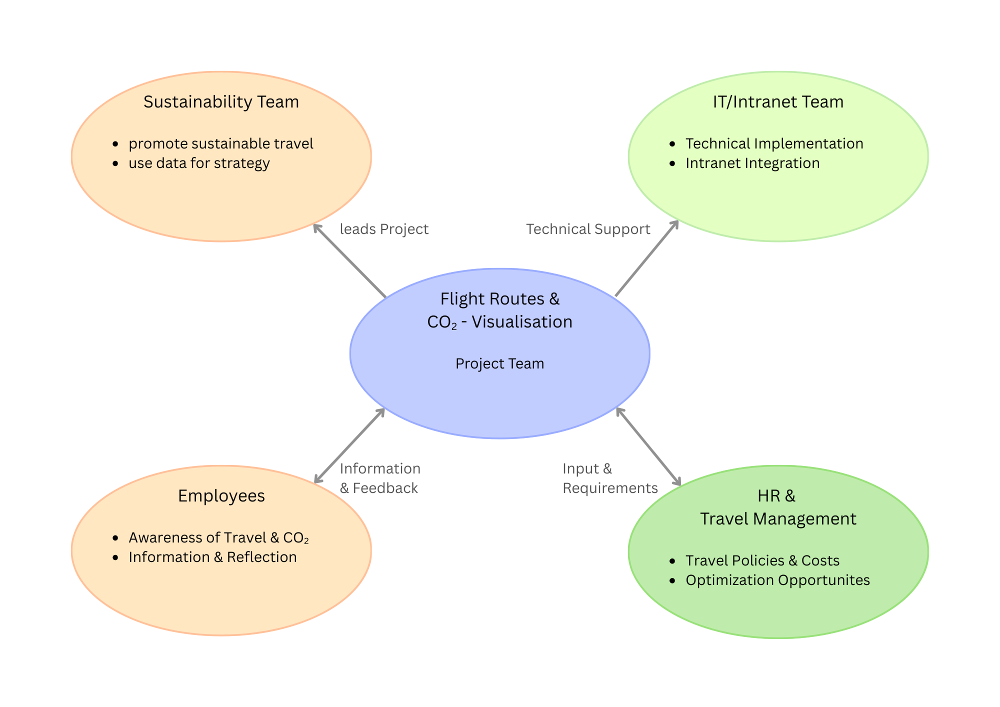

# Project Charta

## Context and Scope
The project examines the travel behaviour of a company’s employees, with a focus on air travel. The aim is to map out global travel routes and present their environmental impact transparently, based on CO₂ emissions and distances. The visualisation is intended to highlight which routes are flown particularly frequently and for which journeys realistic ground-based alternatives (e.g. rail) exist. The benefits lie in raising employees’ awareness of sustainable mobility and in supporting the internal sustainability strategy. The product will be published on the intranet and is aimed exclusively at employees.


## Project Objectives and Success Criteria
The primary goal of this project is to provide employees with a clear understanding of the company’s flight activity—how often flights are taken, where they go, and which routes could realistically be replaced by ground-based alternatives. The visualization is designed to foster internal dialogue around sustainable travel behavior and raise awareness of the environmental impact of business travel. It also serves the sustainability team by delivering data-driven insights to support internal communication and inform policy adjustments.

Success will be measured by several criteria:
* Employees should be able to identify the most frequently used flight routes within 10 seconds.
* The top 5 CO₂-intensive routes must be clearly highlighted.
* Routes with viable train alternatives should be distinctly marked and filterable.
* At least 70% of test users should report that the visualization improved their understanding of the environmental impact of company travel.

The project explicitly excludes individual-level assessments, automated travel recommendations, and real-time data integration.

## Stakeholder Analysis
- Staff (all): should be kept informed and be able to reflect on their travel habits.
- Sustainability team: uses the visualisation for internal communication and strategy development.
- HR/Travel Management: interested in costs, travel policies and opportunities for optimisation.
- IT/Intranet team: responsible for technical integration and deployment.

Stakeholder Map:



## User Analysis
Analyse the target audience of the visualization product and create at least 2 personas with **relevant attributes** such as domain expertise, data literacy, technical environment (devices, screen sizes), frequency of use etc. Amend each persona with the dimensions of the customer profile side in the Value Proposition Canvas @Osterwalder2014:

### Robert, 55 years
::: {.grid}
::: {.g-col-8}
Robert has been with the company for over 20 years and is highly experienced in his professional domain. However, he has limited exposure to sustainability topics and tends to be skeptical about climate-related initiatives. His data literacy is moderate, he can interpret simple charts but struggles with complex analytics. He primarily works on a desktop in the office and occasionally uses a laptop. His engagement with internal tools is infrequent and usually triggered by topical discussions or curiosity.
:::

::: {.g-col-4}
{width=100%}
:::
:::

**User tasks:** Robert wants to understand how much the company actually flies and whether his own travel behavior is significant in comparison.  
**Pains:** He is skeptical of climate messaging and feels overwhelmed by overly complex visualizations. He is also wary of sustainability communication that feels moralizing or prescriptive.  
**Gains:** Robert responds well to clear, neutral facts presented without judgment. He appreciates intuitive visualizations that allow him to form his own opinion based on data.

### Sara, 28 years
::: {.grid}
::: {.g-col-8}
Sara recently joined the company and works in the sustainability strategy unit. She has strong domain expertise in climate and environmental topics and is comfortable working with CO₂ data. Her data literacy is high, and she frequently uses her laptop in mobile settings. She engages with internal tools regularly, especially when preparing presentations or internal discussions.
:::

::: {.g-col-4}
{width=100%}
:::
:::

**User tasks:** Sara aims to identify emission hotspots, gather arguments for more sustainable travel policies, and raise awareness among colleagues.  
**Pains:** She struggles with the lack of transparency around actual travel behavior and finds it challenging to communicate complex data in a way that resonates with skeptical audiences. Internal resistance to sustainability topics is a recurring obstacle.  
**Gains:** Sara values visually compelling and easy-to-understand representations of data. She seeks tools that help her highlight concrete savings potential and support her internal advocacy efforts.

## Situation Assessment
The project is supported by a comprehensive dataset containing flight routes, CO₂ emissions, travel distances, transport modes, train alternatives, travel costs, and geographic coordinates. These data points enable both spatial and environmental analysis of business travel patterns. The technical implementation will rely on tools such as Python for data processing, Quarto for documentation and visualization, and Leaflet or Plotly for interactive mapping. The final product will be deployed within the company’s intranet environment to ensure accessibility for all employees. Personnel involved include the sustainability team (as project initiators and domain experts), a data analyst (for data preparation and visualization logic), and IT support (for integration and performance optimization within the intranet).

Key constraints include strict adherence to data privacy, no individual-level assessments will be conducted, and the requirement that the dashboard performs reliably within the intranet infrastructure. Potential risks include misinterpretation of the data by employees, skepticism toward sustainability messaging, and technical limitations in rendering complex interactive maps. These risks will be mitigated through clear visual design, neutral framing of insights, and performance testing prior to deployment.

## Visualization Concept
Translate the project objectives into a concrete visualization concept. This corresponds to the value map side of the Value Proposition Canvas [@Osterwalder2014] – describe how the proposed visualization product addresses the users' tasks, relieves their pains and creates gains. Address the following aspects:

* **Product form**: Interactive world map with flight routes , supplemented by filters and brief explanatory texts.
* **Visual encodings**: Line colour = CO₂ emissions (e.g. blue → red). Line width = number of journeys or total emissions per route. Icons or markers for rail alternatives.
* **Interactivity**: Filters by time period, business unit, mode of transport. Tooltip showing CO₂, distance, number of flights, rail alternative. Zoom and pan for global and regional views.
* **Narrative and annotation**: The visualization begins with a simple and accessible introduction: “How we travel as a company.” It highlights the five routes with the highest CO₂ emissions to give users an immediate sense of where the greatest environmental impact occurs. The dashboard also points out where train alternatives exist and how much potential reduction in emissions these alternatives could offer. Throughout the presentation, the tone remains neutral and fact‑based, ensuring that the information is conveyed without moral pressure, an approach that is particularly important for users like Robert, who may be skeptical of sustainability messaging.
* **Target medium and integration**: Integration as an HTML widget on the intranet. Optimised for desktop use, compatible with mobile devices.


* **Cognitive and analytical value**: The design makes it easy for users to immediately recognize travel patterns, emission hotspots, and viable alternatives. By encoding CO₂ intensity through color and route frequency through line thickness, the visualization supports fast pattern detection and helps users understand relationships between distance, emissions, and travel behavior. This directly addresses the project goal of enabling employees to grasp how and where the company travels, while giving the sustainability team a clear analytical foundation for identifying high‑impact routes.
* **Communicative value**: he clear and intuitive presentation ensures that information is accessible to very different user groups. Employees like Robert receive neutral, factual insights without feeling overwhelmed, while users like Sara can extract detailed arguments for internal communication and policy discussions. The design bridges these needs by balancing simplicity with depth, supporting the project objective of fostering informed conversations about sustainable travel.
* **Experiential and aesthetic value**: HThe modern, visually appealing map and interactive elements such as zooming and moving the map encourage exploration and increase user engagement. This aesthetic quality builds trust and makes the dashboard more inviting, which is essential for adoption—especially among users who may be skeptical of sustainability topics. By creating a positive and engaging experience, the design reinforces the project’s aim of raising awareness and motivating reflection on travel behavior.


## Project Plan
Divide the project into individual phases, describe them briefly and draw up a preliminary timetable, e.g. as a Gantt chart:

```{mermaid}
%%| label: fig-project-plan
%%| fig-cap: Preliminary project plan in the form of a Gantt chart.
gantt
    title Project Plan
    dateFormat YYYY-MM-DD
    tickInterval 5day
    section Project Understanding
        Initiation workshop and context analysis     :a1, 2024-07-01, 1d
        Stakeholder and user analysis     :a3, 2024-07-02, 5d
        Situation assessment    :a4, 2024-07-06, 1d
        Project objectives and visualization concept    :a5, 2024-07-07, 1d
        Sign project charta: milestone, m1, 2024-07-08, 1d
    
    section Data Acquisition and Exploration
        Acquire data :a6, 2024-07-08, 3d
        Exploratory data analysis   :a7, 2024-07-09, 2d
        Discuss data report: milestone, m2, 2024-07-11, 1d
        
    section Visual Encoding and Design
        Overview charts   :a8, 2024-07-11, 3d
        Maps :a9, 2024-07-11, 5d
        Implement Dashboard prototype :a10, 2024-07-16, 5d
        Complete visualization report :a10, 2024-07-21, 1d
    section Evaluation
        Prepare presentation :a10, 2024-07-22, 2d
        Project presentation : milestone, m2, 2024-07-24, 4m
```

See [Mermaid syntax for Gantt charts](https://mermaid.js.org/syntax/gantt.html). It might not be displayed correctly in Safari &#8594; use Chrome. [Live editor with export functionality](https://mermaid.live/)

## Roles and Contact Details
List the people involved in the development work here with their role titles, tasks and contact details.
