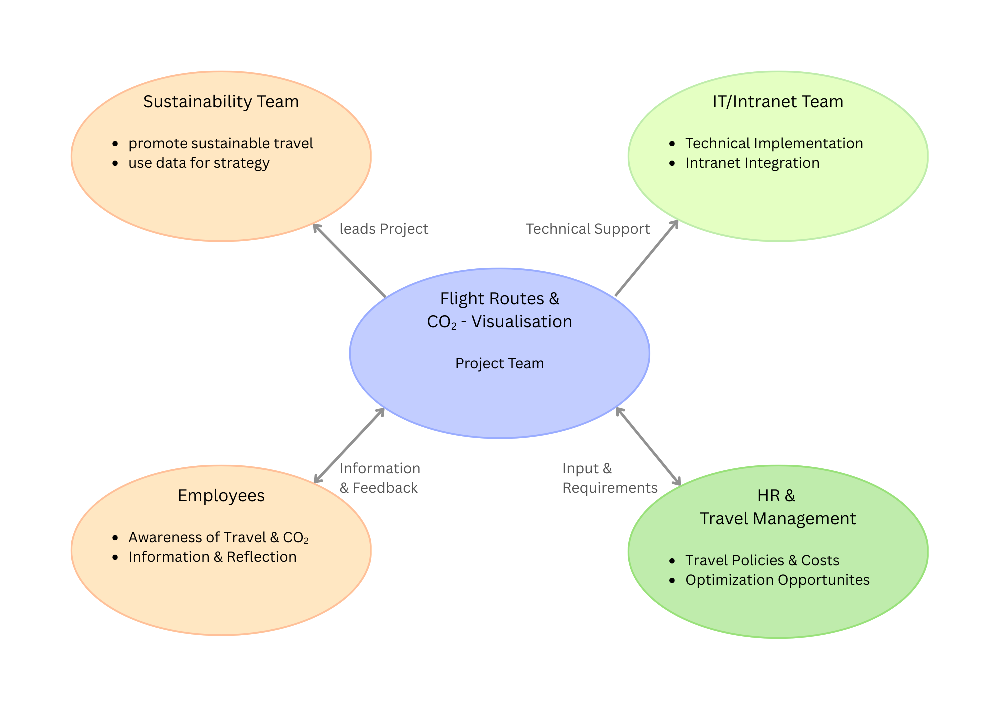

# Project Charta

## Context and Scope
The Aurevia Group (change name of this company), a European technology services company with the four business units Sales & Customer Markets, Operations & Delivery, Technology & Innovation, and Corporate Services has commissioned NovaVista Digital Solutions (change name of this company) to redesign and unify its business‑travel processes. Historically, employees booked trips through inconsistent channels, ranging from self‑service to delegation to assistants, resulting in inefficiencies, limited transparency, and inconsistent data quality. At the same time, Aurevia aims to reduce CO₂ emissions by 5% per business unit each year.

To address these challenges, the project introduces a multi‑page intranet dashboard that simplifies travel booking, visualizes travel patterns, and supports Aurevia’s sustainability goals. The dashboard includes a booking page for planning business trips, analytical pages showing European and global travel routes and emissions, a quiz to engage employees through gamification, and a feedback page for continuous improvement. The product is intended exclusively for employees and aims to foster awareness, transparency, and more consistent travel processes across the organization.


## Project Objectives and Success Criteria
The primary objective is to provide employees with a unified, intuitive platform for booking business trips and understanding company‑wide travel behavior. The dashboard should highlight frequently used routes, CO₂‑intensive travel patterns, and opportunities to shift from air to rail where feasible. It also supports Aurevia’s sustainability strategy by making CO₂ emissions visible at the business‑unit level and by motivating employees through gamification elements.
- Success will be measured by the following criteria:
- Employees can complete a travel booking in under two minutes.
- The most frequently used routes and top CO₂‑intensive routes are identifiable within 10 seconds.
- Business units can clearly track their progress toward the –5% annual CO₂‑reduction target.
- Routes with viable train alternatives are distinctly marked.
- The feedback page generates meaningful suggestions for further development.

The project explicitly excludes real‑time price comparisons, automated travel recommendations, and individual‑level CO₂ assessments.

## Stakeholder Analysis
- Employees (all): use the booking page, analytics pages, quiz, and feedback form
- BU Leadership: monitors CO₂ performance and gamification points
- Sustainability team: uses the analytics pages for internal communication and strategy development
- HR/Travel Management: interested in process standardization, cost transparency and opportunities for optimisation
- IT/Intranet team: responsible for technical integration, deployment and performance

Stakeholder Map:



## User Analysis
Analyse the target audience of the visualization product and create at least 2 personas with **relevant attributes** such as domain expertise, data literacy, technical environment (devices, screen sizes), frequency of use etc. Amend each persona with the dimensions of the customer profile side in the Value Proposition Canvas @Osterwalder2014:

### Robert, 55 years
::: {.grid}
::: {.g-col-8}
Robert has been with the company for over 20 years and works in Sales & Customer Markets. He is highly experienced in his field but has limited exposure to sustainability topics and tends to be skeptical about climate‑related initiatives. His data literacy is moderate; he can interpret simple charts but struggles with complex analytics. He frequently travels to meet clients and therefore uses both his office desktop and his laptop while on the move. He uses internal tools infrequently, usually only when necessary for his work.
:::

::: {.g-col-4}
{width=100%}
:::
:::

**User tasks:** Robert wants to book trips quickly and understand major travel patterns without being overwhelmed.  
**Pains:** He is skeptical of climate messaging and feels overwhelmed by overly complex visualizations. He is also wary of sustainability communication that feels moralizing or prescriptive.  
**Gains:** Robert responds well to clear, neutral facts presented without judgment. He appreciates intuitive visualizations that allow him to form his own opinion based on data.

### Sara, 28 years
::: {.grid}
::: {.g-col-8}
Sara works in Operations & Delivery, where she coordinates cross‑functional projects and ensures smooth execution of operational processes. Her familiarity with CO₂ data comes from a combination of professional exposure — Operations & Delivery regularly evaluates efficiency, resource usage, and travel patterns — and personal interest in sustainability. She has high data literacy, uses her laptop frequently in mobile settings, and engages with internal tools regularly to prepare discussions, identify improvement opportunities, and support more sustainable decision‑making.
:::

::: {.g-col-4}
{width=100%}
:::
:::

**User tasks:** Sara aims to identify emission hotspots, compare business‑unit performance, and communicate insights effectively.  
**Pains:** She struggles with the lack of transparency in current travel data and finds it difficult to communicate complex information to skeptical colleagues.
**Gains:** She values clear, visually compelling representations that support her advocacy for more sustainable travel.

## Situation Assessment
The project is supported by a comprehensive dataset containing flight and train routes, CO₂ emissions, distances, travel frequencies, business‑unit assignments, transport modes, and geographic coordinates. These data enable both spatial and environmental analysis of business travel patterns.

The dashboard consists of five pages:
- A Booking page for planning trips and comparing flight and rail options.
- A Europe analytics page showing frequently flown routes, CO₂ hotspots, and BU performance.
- A Worldwide analytics page with global travel patterns.
- A Quiz page that engages employees through character outcomes.
- A Feedback page for collecting suggestions and improvement ideas.

Technical implementation relies on Python and Streamlit for data processing and interactive visualization. The dashboard will be deployed on the company’s intranet to ensure accessibility. Key constraints include data privacy, performance requirements, and the need for neutral communication to avoid resistance among skeptical users. Risks include misinterpretation of CO₂ data, skepticism toward sustainability messaging, and technical limitations when rendering complex maps. These risks will be mitigated through clear visual design, neutral framing, and performance testing.

## Visualization Concept
Translate the project objectives into a concrete visualization concept. This corresponds to the value map side of the Value Proposition Canvas [@Osterwalder2014] – describe how the proposed visualization product addresses the users' tasks, relieves their pains and creates gains. Address the following aspects:

* **Product form**: The product consists of five interactive pages:
(1) a booking interface for planning business trips and comparing flight and train options,
(2) a European analytics page showing frequently used routes, CO₂ hotspots, and business‑unit performance,
(3) a global analytics page with the same logic applied worldwide,
(4) a quiz page that engages employees through character outcomes, and
(5) a feedback page for collecting suggestions and improvement ideas.
* **Visual encodings**: Line color represents the travel mode.
* **Interactivity**: Filters by time period, business unit, departure and arrival city. Tooltips provide contextural information such as CO₂ emissions, distance and availability of train alternatives. Maps support zooming and panning for both global and regional exploration. The booking page dynamically updates travel time, CO₂ impact, and gamification points based on user input.
* **Narrative and annotation**: The visualization begins with a simple and accessible introduction: “How we travel as a company.” It highlights the five routes with the highest CO₂ emissions to give users an immediate sense of where the greatest environmental impact occurs. The dashboard also points out where train alternatives exist and how much potential reduction in emissions these alternatives could offer. Throughout the presentation, the tone remains neutral and fact‑based, ensuring that the information is conveyed without moral pressure, an approach that is particularly important for users like Robert, who may be skeptical of sustainability messaging.
* **Target medium and integration**: Integration as an HTML widget on the intranet. Optimised for desktop use, compatible with mobile devices.


* **Cognitive and analytical value**: The design makes it easy for users to immediately recognize travel patterns, emission hotspots, and viable alternatives. By encoding CO₂ intensity through color and route frequency through line thickness, the visualization supports fast pattern detection and helps users understand relationships between distance, emissions, and travel behavior. This directly addresses the project goal of enabling employees to grasp how and where the company travels, while giving the sustainability team a clear analytical foundation for identifying high‑impact routes.
* **Communicative value**: he clear and intuitive presentation ensures that information is accessible to very different user groups. Employees like Robert receive neutral, factual insights without feeling overwhelmed, while users like Sara can extract detailed arguments for internal communication and policy discussions. The design bridges these needs by balancing simplicity with depth, supporting the project objective of fostering informed conversations about sustainable travel.
* **Experiential and aesthetic value**: HThe modern, visually appealing map and interactive elements such as zooming and moving the map encourage exploration and increase user engagement. This aesthetic quality builds trust and makes the dashboard more inviting, which is essential for adoption—especially among users who may be skeptical of sustainability topics. By creating a positive and engaging experience, the design reinforces the project’s aim of raising awareness and motivating reflection on travel behavior.


## Project Plan
Divide the project into individual phases, describe them briefly and draw up a preliminary timetable, e.g. as a Gantt chart:

```{mermaid}
%%| label: fig-project-plan
%%| fig-cap: Preliminary project plan in the form of a Gantt chart.
gantt
    title Project Plan
    dateFormat YYYY-MM-DD
    tickInterval 5day
    section Project Understanding
        Initiation workshop and context analysis     :a1, 2026-04-14, 1d
        Stakeholder and user analysis     :a3, 2026-04-15, 5d
        Situation assessment    :a4, 2026-04-22, 1d
        Project objectives and visualization concept    :a5, 2026-04-23, 1d
        Sign project charta: milestone, m1, 2026-04-24, 1d
    
    section Data Acquisition and Exploration
        Acquire data :a6, 2026-05-04, 3d
        Exploratory data analysis   :a7, 2026-05-07, 2d
        Discuss data report: milestone, m2, 2026-05-11, 1d
        
    section Visual Encoding and Design
        Overview charts   :a8, 2026-05-12, 3d
        Maps :a9, 2026-05-15, 5d
        Implement Dashboard prototype :a10, 2026-05-22, 5d
        Complete visualization report :a10, 2026-05-29, 1d
    section Evaluation
        Prepare presentation :a10, 2026-06-01, 2d
        Project presentation : milestone, m2, 2026-06-08, 4m
```

See [Mermaid syntax for Gantt charts](https://mermaid.js.org/syntax/gantt.html). It might not be displayed correctly in Safari &#8594; use Chrome. [Live editor with export functionality](https://mermaid.live/)

## Roles and Contact Details

| Name            | Role         | Contact Details           |
|-----------------|--------------|---------------------------|
| Imhof Alexandra | Collaborator | imhofal1@students.zhaw.ch |
| Labarile Vivien | Collaborator | labarviv@students.zhaw.ch |
| Lauber Annina   | Collaborator | laubeann@students.zhwa.ch |

The project team works collaboratively and without fixed role assignments. All members jointly take on tasks in data analysis, visualization, sustainability research, communication, and stakeholder management. Decisions are made collectively within the team, and responsibility for the project outcome is shared equally.